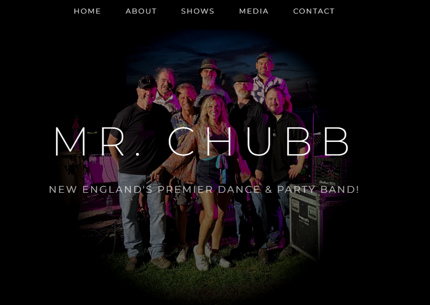
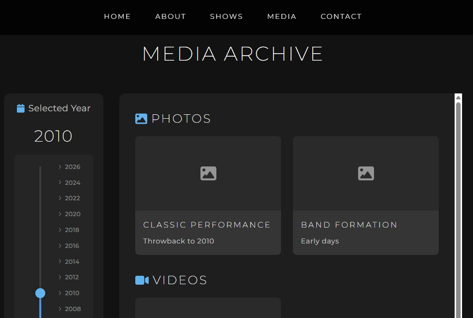
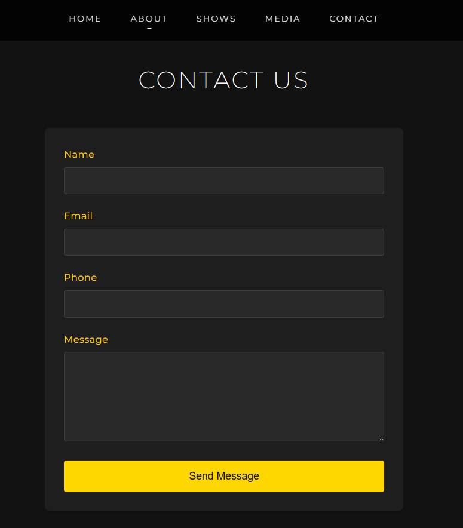

# MrChubb Band Website

_"A work in progress"_  
 &nbsp;&nbsp;&nbsp;&nbsp;&nbsp;&nbsp;&nbsp;&nbsp;&nbsp;&nbsp;&nbsp;&nbsp;&nbsp;&nbsp;&nbsp;&nbsp;&nbsp;&nbsp;&nbsp;&nbsp;&nbsp;&nbsp;&nbsp;&nbsp;&nbsp;&nbsp; _~Matt_

A modern, interactive website for the MrChubb band, built with React and styled-components.

## Screenshots

### Homepage


### Media Archive


### Contact Page


## Features

- **Home Page**: Welcome page with band introduction and featured content
- **About Page**: Information about the band, members, and history
- **Media Archive**: Interactive year slider (1996-2026) to browse photos, videos, and documents by year
- **Calendar**: Event calendar showing upcoming performances and important dates
- **Contact Page**: Contact form powered by EmailJS for fan inquiries

## Technology Stack

- **React 19.0.0**: Modern UI library for building interactive interfaces
- **React Router DOM 7.1.5**: Client-side routing for seamless navigation
- **Styled Components 6.1.14**: CSS-in-JS styling solution
- **FontAwesome**: Icon library for visual elements
- **React Calendar 5.1.0**: Interactive calendar component
- **EmailJS**: Email service integration for contact form

## Getting Started

### Prerequisites

- Node.js (v14 or higher)
- npm or yarn package manager

### Installation

1. Clone the repository:
```bash
git clone <repository-url>
cd MrChubb
```

2. Install dependencies:
```bash
npm install
```

3. Start the development server:
```bash
npm start
```

The application will open in your browser at `http://localhost:3000`

## Available Scripts

- `npm start` - Runs the app in development mode
- `npm build` - Builds the app for production to the `build` folder
- `npm test` - Launches the test runner in interactive watch mode
- `npm eject` - Ejects from Create React App (one-way operation)

## Project Structure

```
MrChubb/
├── public/              # Static files
│   ├── images/         # Image assets
│   └── index.html      # HTML template
├── src/
│   ├── components/     # Reusable React components
│   │   ├── NavBar.js   # Navigation bar
│   │   └── YearSlider.js # Interactive year slider
│   ├── data/           # Data files
│   │   └── sampleMedia.js # Media archive data
│   ├── pages/          # Page components
│   │   ├── Home.js
│   │   ├── About.js
│   │   ├── Media.js
│   │   ├── Calendar.js
│   │   └── Contact.js
│   ├── styles/         # Global styles
│   │   └── GlobalStyles.js
│   ├── App.js          # Main application component
│   └── index.js        # Application entry point
└── package.json        # Project dependencies
```

## Features in Detail

### Media Archive
The Media Archive features an innovative vertical year slider that allows users to browse through 30 years of band history (1996-2026). Users can:
- Drag the slider handle to select a year
- Click anywhere on the slider track to jump to a year
- Use mouse wheel to scroll through years
- View photos, videos, and documents for each year

### Contact Form
The contact form uses EmailJS to send messages directly to the band without requiring a backend server. Configure your EmailJS credentials in the Contact component to enable this feature.

## Customization

### Adding Media Content
Edit `src/data/sampleMedia.js` to add or modify media content for different years:

```javascript
export const mediaData = {
  2026: {
    photos: [...],
    videos: [...],
    documents: [...]
  }
};
```

### Styling
Global styles are defined in `src/styles/GlobalStyles.js`. Component-specific styles use styled-components for scoped, maintainable CSS.

## Browser Support

- Chrome (latest)
- Firefox (latest)
- Safari (latest)
- Edge (latest)

## License

This project is private and proprietary.

## Contact

For questions or support, please use the contact form on the website.
